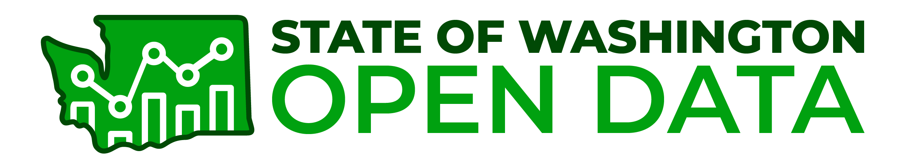
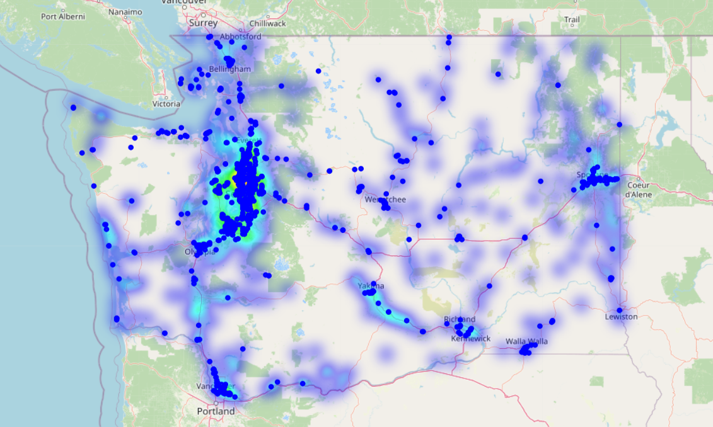
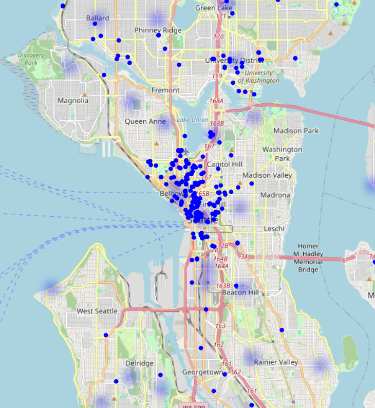
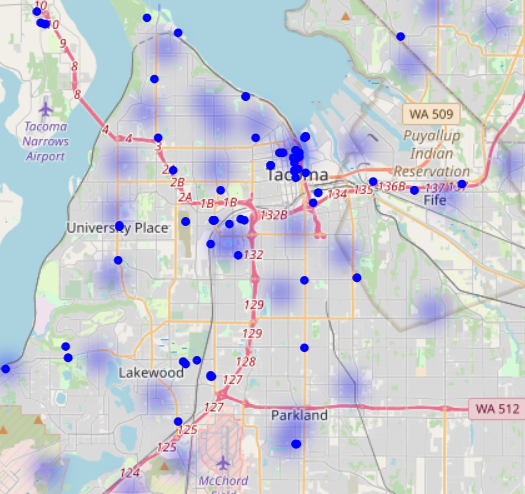
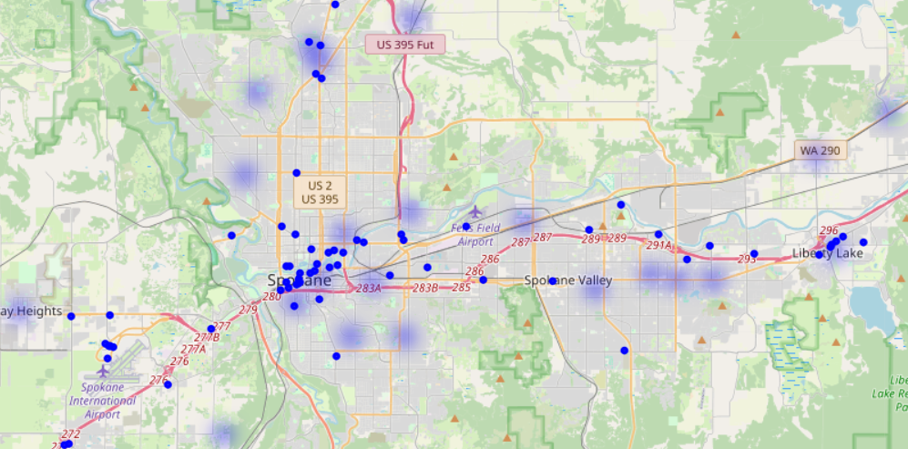
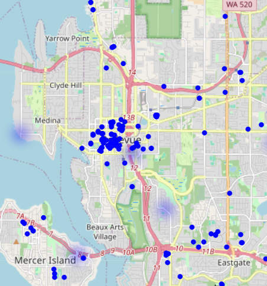
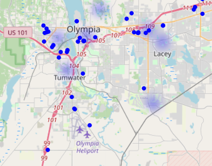

# Optimizing EV Charging Infrastructure: A Data-Driven Approach for Washington

   
  
  
  

## **Analysis of EV Charging Stations by Location, Fast Charger Availability, and Density**

---

## **TABLE OF CONTENTS**

- [**Executive Summary**](#executive-summary)
- [**Motivation**](#motivation)
- [**Data**](#data)
- [**Data Question**](#data-question)
- [**Analytical Approach**](#analytical-approach)
- [**Known Issues and Challenges**](#known-issues-and-challenges)
- [**Minimum Viable Product (MVP)**](#minimum-viable-product-mvp)
- [**Tools Used**](#tools-used)
- [**Sources**](#sources)
- [**Power BI Charts**](#power-bi-charts)
- [**Map Visualizations**](#map-visualizations) 
---

## **EXECUTIVE SUMMARY**

This capstone project aims to design a strategy for the efficient distribution of **electric vehicle (EV) charging networks** to make EV adoption more viable and accessible. The goal is to analyze and optimize the placement of charging stations across Washington, ensuring that infrastructure meets the needs of current and future EV users. This project utilizes public datasets, government statistics, and industry reports. Known challenges include integrating diverse data sources and modeling the distribution effectively.

---

## **MOTIVATION**

The demand for Electric Vehicles (EVs) has been increasing, and with it, the need for a robust charging infrastructure. This project analyzes the availability of **EV charging stations** across Washington state, focusing on:

- The distribution of **Fast Charging Stations (DC Fast Chargers)** across different routes.
- Identifying areas with **high and low charger availability**.
- Examining the correlation between charger locations and population density.

This analysis aims to provide insights for policymakers, urban planners, and businesses investing in EV infrastructure.

---

## **DATA QUESTION**

The primary question guiding this project is:  
**What are the key factors for optimizing the distribution of EV charging stations in Washington?**

To support this investigation, the following key questions were analyzed:

- What are the **optimal locations** for charging stations in Washington based on traffic flow and population density?
- Which cities in Washington have the **highest concentration of EVs**, and how does this correlate with the availability of charging stations?
- How many charging stations in Washington support **fast charging (EV DC Fast Count)**, and where are they located?
- How does the distribution of the **EV population and chargers** vary across cities in Washington?

The analysis relies on publicly available datasets, including **U.S. charging stations (2021) and the EV population in Washington (2023)**.

---

## **DATA**

To answer these questions, I used publicly available EV charging station data. The dataset includes:

- **ZIP Code**
- **Latitude & Longitude**
- **Street Address**
- **Number of DC Fast Chargers** per station

Data was cleaned and processed to visualize charging station density and highlight the most and least served routes.

### **Data Sources**

- [Alternative Fueling Station Locations](https://catalog.data.gov/dataset/alternative-fueling-station-locations-422f2/resource/341957d8-daf6-4a38-ab1d-8ec1bc21cfb9) (U.S. charging stations, 2021)
- [Electric Vehicle Population Data](https://catalog.data.gov/dataset/electric-vehicle-population-data) (Washington EV population, 2023)

---

## **ANALYTICAL APPROACH**

To overcome the challenges of integrating diverse data sources and effectively modeling EV station distribution, I applied the following strategies:

- **Mapped routes with the highest and lowest number of Fast Chargers**.
- **Ranked Cities by charger density** to identify deficit areas.
- **Created interactive Power BI dashboards** to explore station distributions dynamically.

---

## **KNOWN ISSUES AND CHALLENGES**

### **Data Integration**

- Combining and cleaning data from different sources and levels of detail may require significant time.
- **Plan:** Focus on simplifying data sources and using only what is necessary to meet project goals.

### **Scope Management**

- Due to time constraints, only specific questions will be addressed, such as optimizing charging infrastructure or analyzing EV population trends.
- **Plan:** Prioritize charging infrastructure analysis using population and traffic data.

### **Visualization Complexity**

- Presenting complex information clearly.
- **Plan:** Iterate with feedback and use advanced visual tools like Power BI.

---

## **MINIMUM VIABLE PRODUCT (MVP)**

Given the limited time available for this capstone project, the scope has been refined to ensure feasibility. The final project includes:

- **A Power BI dashboard** visualizing EV charging station distribution.
- **Geospatial analysis** of EV fast charger locations and density.
- **Insights on underserved areas** for potential future charging station placement.
- **Recommendations** for policymakers and stakeholders to enhance EV infrastructure.

---

## **TOOLS USED**

- **Python (Pandas, Folium)** – Data cleaning, processing, and geospatial visualization.
- **Power BI** – Interactive dashboard for route analysis.
- **Excel** – Initial data review and filtering.
- **PowerPoint** – Presentation of key findings and insights.
- **Git & GitHub** – Version control and project documentation.

---

## **SOURCES**

This data was sourced from:

- [U.S. Department of Energy Alternative Fuels Data Center](https://afdc.energy.gov/stations/#/analyze)
- [Washington State Open Data](https://data.wa.gov/Transportation/Electric-Vehicle-Charging-Stations/)
- [U.S. Census Bureau](https://www.census.gov/)

### **Additional Research**

- [Washington State Department of Transportation Real-Time Map](https://wsdot.com/Travel/Real-time/Map/)
- [EV Fast Charging Route Planner](https://afdc.energy.gov/stations#/find/route?fuel=ELEC\&ev_levels=dc_fast\&ev_connectors=J1772\&start=seattle\&end=redimon)

---

## **POWER BI charts**

To explore the **interactive analysis of EV charging stations**, visit my Power BI charts:  

- [EV Population and Charging Stations Power BI](https://app.powerbi.com/view?r=eyJrIjoiMzhhMTVmYjMtOTU4Ni00ZWJlLWIwYjUtMDBjNWYwOTc1OGZkIiwidCI6IjEwMWRhNTg3LTE4NDMtNGY1Mi04YjhhLTE3YjA2OWM2NmQzMyIsImMiOjJ9))

---

## **MAP VISUALIZATIONS**

Below are some maps visualized in Python, Pandas:

   
  
  
   
  
    
    
  

